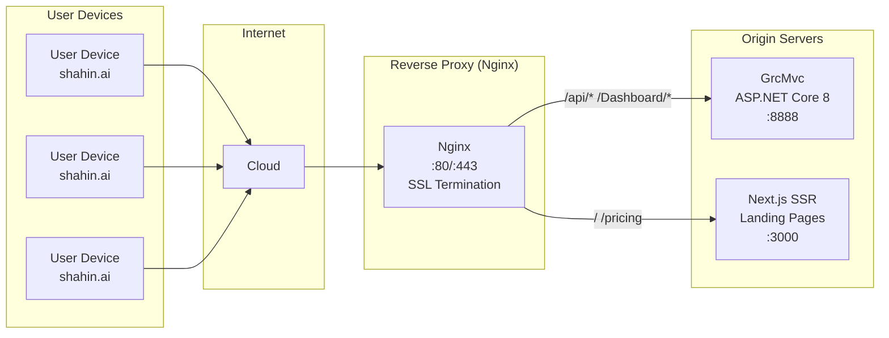
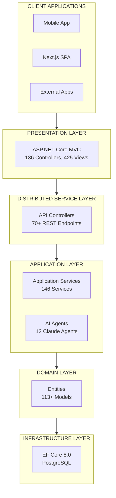
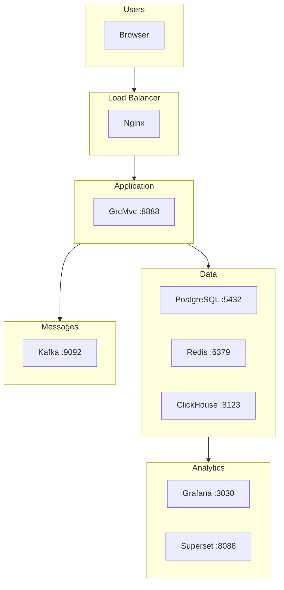
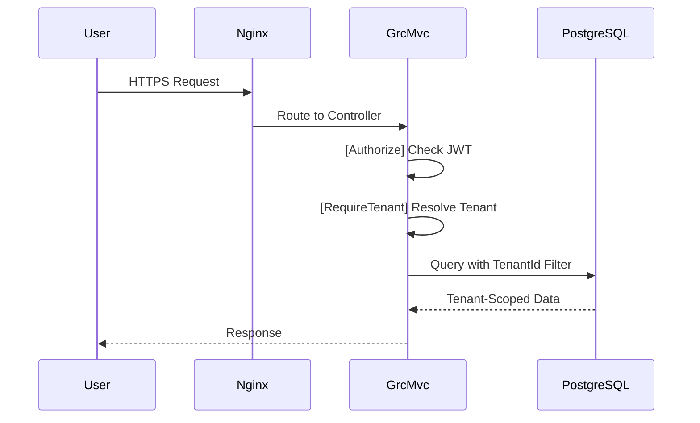
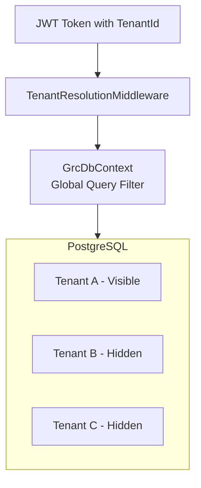

# Shahin AI GRC Platform - Architecture Documentation

## Overview

The Shahin AI GRC Platform is an enterprise-grade Governance, Risk, and Compliance (GRC) solution built on the ABP Framework with ASP.NET Core 8.0.

### Technology Stack

| Layer | Technology |
|-------|------------|
| Frontend | Next.js 14 SSR + ASP.NET Core MVC Razor |
| Backend | ASP.NET Core 8.0 + ABP Framework |
| Database | PostgreSQL 15 (GrcMvcDb + GrcAuthDb) |
| Cache | Redis 7 |
| Message Queue | Apache Kafka |
| Workflow Engine | Camunda BPM 7.20 |
| Analytics | ClickHouse OLAP |
| AI | Claude AI (Anthropic) |

---

## Architecture Diagrams

### 1. Reverse Proxy Flow

Shows how user requests flow through the reverse proxy to origin servers.

[View full diagram](architecture/reverse-proxy-flow.mmd)

---

### 2. ABP Framework Layered Architecture

Shows all application layers following ABP/Clean Architecture principles.

[View full diagram](architecture/abp-layers.mmd)

---

### 3. Docker Infrastructure

Shows all containerized services and their connections.

[View full diagram](architecture/docker-infra.mmd)

---

### 4. Request Flow Sequence

Shows the complete lifecycle of an HTTP request through all layers.

[View full diagram](architecture/request-flow.mmd)

---

### 5. Multi-Tenant Data Flow

Shows how tenant isolation works at the database level.

[View full diagram](architecture/multi-tenant.mmd)

---

## Route Inventory

### Summary

| Category | Count |
|----------|-------|
| MVC Controllers | 50+ |
| API Controllers | 70+ |
| Razor Views | 425+ |
| Public Routes | 15+ |
| Protected Routes | 100+ |
| Webhook Endpoints | 3 |

### Route Categories

#### Public Routes (AllowAnonymous)

| Route | Controller | Purpose |
|-------|------------|---------|
| `/` | LandingController | Landing page |
| `/pricing` | LandingController | Pricing |
| `/features` | LandingController | Features |
| `/about` | LandingController | About us |
| `/contact` | LandingController | Contact |
| `/Help` | HelpController | Help center |

#### Authentication Routes

| Route | Controller | Purpose |
|-------|------------|---------|
| `/Account/Login` | AccountController | User login |
| `/register` | RegisterController | Self-registration |
| `/auth/activate` | AuthController | Email verification |
| `/Account/ForgotPassword` | AccountController | Password reset |
| `/Account/LoginWith2fa` | AccountController | 2FA verification |

#### Protected Routes [Authorize]

| Route | Controller | Purpose |
|-------|------------|---------|
| `/Dashboard` | DashboardController | Main dashboard |
| `/Assessment` | AssessmentController | Assessments |
| `/Audit` | AuditController | Audit findings |
| `/Control` | ControlController | Controls |
| `/Evidence` | EvidenceController | Evidence management |
| `/Risk` | RiskController | Risk register |
| `/Policy` | PolicyController | Policies |
| `/Onboarding` | OnboardingController | Setup wizard |

#### Admin Routes [Authorize(Admin)]

| Route | Controller | Purpose |
|-------|------------|---------|
| `/Admin` | AdminController | Admin dashboard |
| `/AdminPortal` | AdminPortalController | Admin portal |
| `/TenantAdmin` | TenantAdminController | Tenant management |
| `/PlatformTenants` | PlatformTenantsController | Multi-tenant management |

#### API Endpoints

| Route | Controller | Purpose |
|-------|------------|---------|
| `api/health` | ApiHealthController | Health check |
| `api/agent/*` | AgentController | AI agent operations |
| `api/dashboard/*` | DashboardController | Dashboard data |
| `api/workflows/*` | WorkflowApiController | Workflow operations |
| `api/system/*` | SystemApiController | System management |

#### Webhook Endpoints [AllowAnonymous]

| Route | Controller | Purpose |
|-------|------------|---------|
| `api/webhooks/email` | EmailWebhookController | Microsoft Graph notifications |
| `api/webhooks/stripe` | PaymentWebhookController | Stripe payment events |

---

## Cross-Cutting Concerns

### Security
- **Authorization**: 214+ permission attributes
- **Authentication**: JWT Bearer tokens
- **Multi-Tenancy**: Row-level isolation via global query filters

### Performance
- **Caching**: Redis distributed cache
- **Session Management**: Concurrent session limits

### Operations
- **Logging**: Serilog structured logging
- **Audit Logging**: Complete audit trail for all changes
- **Dependency Injection**: Full DI via ABP Framework

---

## File Locations

| File | Location |
|------|----------|
| Reverse Proxy Diagram | `docs/architecture/reverse-proxy-flow.mmd` |
| ABP Layers Diagram | `docs/architecture/abp-layers.mmd` |
| Docker Infrastructure | `docs/architecture/docker-infra.mmd` |
| Request Flow Sequence | `docs/architecture/request-flow.mmd` |
| Multi-Tenant Flow | `docs/architecture/multi-tenant.mmd` |
| Route Inventory | `docs/route-inventory.json` |

---

## Security Considerations

### Known Issues (To Fix)

1. **SeedController**: 21 endpoints have `[AllowAnonymous]` that should be secured
2. **AuthenticationService**: Mock users bypass real authentication
3. **docker-compose.yml**: Hardcoded credential fallbacks
4. **create-user.cs**: Hardcoded connection string fallback

### Good Practices (Verified)

- Password hashing via ASP.NET Identity
- JWT secret minimum 32 characters enforced
- CSRF protection on all forms
- File upload validation with magic bytes
- AI prompt injection detection
- Multi-tenant data isolation

---

## Related Documentation

- [Security Audit Report](../SECURITY_AUDIT_REPORT.md)
- [Phase 1 Implementation Status](../PHASE_1_IMPLEMENTATION_STATUS.md)
- [Quick Start Guide](../PHASE_1_QUICK_START.md)
