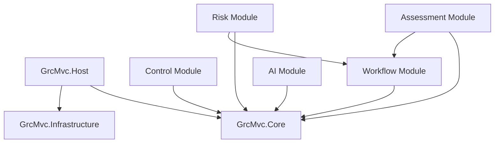

# Modular Architecture Analysis & Refactoring Plan

**Date:** January 17, 2026  
**Status:** 🔍 **ANALYSIS COMPLETE**  
**Objective:** Refactor monolithic application into modular, pluggable architecture

---

## 📊 Current Architecture Analysis

### 1. Current Layering Structure

```
┌─────────────────────────────────────┐
│         Presentation Layer          │
│  (Controllers, Views, ViewModels)   │
├─────────────────────────────────────┤
│        Application Layer            │
│    (Services, DTOs, Mappings)      │
├─────────────────────────────────────┤
│         Domain Layer                │
│    (Entities, Value Objects)       │
├─────────────────────────────────────┤
│      Infrastructure Layer          │
│  (Data, Email, Integrations)       │
└─────────────────────────────────────┘
```

### 2. Identified Issues

| Issue | Severity | Impact |
|-------|----------|--------|
| **Monolithic Service Registration** | HIGH | All 100+ services registered in single file |
| **Tight Coupling** | HIGH | Services directly depend on implementations |
| **No Module Boundaries** | HIGH | Everything accessible from everywhere |
| **Mixed Concerns** | MEDIUM | Business logic mixed with infrastructure |
| **No Plugin System** | HIGH | Cannot add/remove features dynamically |
| **Large DbContext** | HIGH | 230+ entities in single context |
| **No Feature Isolation** | MEDIUM | All features loaded regardless of need |

### 3. Current Service Categories

Based on `ServiceCollectionExtensions.cs` analysis:

- **Core GRC Services**: 17 services
- **Workflow Services**: 15 services  
- **RBAC Services**: 7 services
- **Integration Services**: 12 services
- **AI Agent Services**: 12 services
- **Notification Services**: 7 services
- **Analytics Services**: 5 services
- **Background Jobs**: 7 services

**Total:** ~82 services (excluding framework services)

---

## 🎯 Target Modular Architecture

### 1. Module-Based Structure

```
GrcMvc.Host (Main Application)
│
├── Core Modules (Required)
│   ├── GrcMvc.Core
│   ├── GrcMvc.Infrastructure
│   └── GrcMvc.SharedKernel
│
├── Feature Modules (Pluggable)
│   ├── GrcMvc.Modules.Assessment
│   ├── GrcMvc.Modules.Risk
│   ├── GrcMvc.Modules.Control
│   ├── GrcMvc.Modules.Audit
│   ├── GrcMvc.Modules.Policy
│   ├── GrcMvc.Modules.Vendor
│   └── GrcMvc.Modules.Compliance
│
├── Extension Modules (Optional)
│   ├── GrcMvc.Modules.Workflow
│   ├── GrcMvc.Modules.AI
│   ├── GrcMvc.Modules.Analytics
│   └── GrcMvc.Modules.Integrations
│
└── Plugin System
    ├── GrcMvc.PluginFramework
    └── GrcMvc.PluginLoader
```

### 2. Module Interface Definition

```csharp
public interface IGrcModule
{
    string Name { get; }
    string Version { get; }
    ModulePriority Priority { get; }
    
    void ConfigureServices(IServiceCollection services);
    void Configure(IApplicationBuilder app);
    Task OnStartupAsync(IServiceProvider provider);
    Task OnShutdownAsync();
    
    IEnumerable<Type> GetExportedTypes();
    IEnumerable<ModuleDependency> GetDependencies();
}
```

---

## 📦 Detailed Module Breakdown

### Core Modules

#### 1. **GrcMvc.Core** (Foundation)
- **Purpose**: Core domain models and interfaces
- **Contains**:
  - Base entities
  - Core interfaces
  - Domain events
  - Shared DTOs
  - Common exceptions

#### 2. **GrcMvc.Infrastructure** (Cross-Cutting)
- **Purpose**: Infrastructure services
- **Contains**:
  - Database contexts (modular)
  - Repository implementations
  - Caching
  - Logging
  - Email services

#### 3. **GrcMvc.SharedKernel** (Utilities)
- **Purpose**: Shared utilities and helpers
- **Contains**:
  - Extensions
  - Validators
  - Mappers
  - Common patterns

### Feature Modules

#### 1. **GrcMvc.Modules.Assessment**
```csharp
public class AssessmentModule : ModuleBase
{
    public override string Name => "Assessment Management";
    public override string Version => "1.0.0";
    
    public override void ConfigureServices(IServiceCollection services)
    {
        services.AddScoped<IAssessmentService, AssessmentService>();
        services.AddScoped<IAssessmentExecutionService, AssessmentExecutionService>();
        services.AddScoped<IAssessmentTemplateService, AssessmentTemplateService>();
    }
    
    public override void ConfigureDatabase(ModelBuilder modelBuilder)
    {
        modelBuilder.ApplyConfiguration<Assessment>(new AssessmentConfiguration());
        modelBuilder.ApplyConfiguration<AssessmentTemplate>(new AssessmentTemplateConfiguration());
    }
}
```

#### 2. **GrcMvc.Modules.Risk**
```csharp
public class RiskModule : ModuleBase
{
    public override string Name => "Risk Management";
    public override string Version => "1.0.0";
    
    public override void ConfigureServices(IServiceCollection services)
    {
        services.AddScoped<IRiskService, RiskService>();
        services.AddScoped<IRiskMatrixService, RiskMatrixService>();
        services.AddScoped<IRiskAssessmentWorkflowService, RiskAssessmentWorkflowService>();
    }
}
```

### Extension Modules

#### 1. **GrcMvc.Modules.Workflow**
- All workflow services
- BPMN parser
- Workflow engine
- Escalation services

#### 2. **GrcMvc.Modules.AI**
- Claude agent services
- AI integrations
- NLP services
- Predictive analytics

#### 3. **GrcMvc.Modules.Analytics**
- Dashboard services
- ClickHouse integration
- Reporting engine
- KPI tracking

---

## 🔧 Refactoring Plan

### Phase 1: Foundation (Week 1-2)

1. **Create Module Framework**
   - [ ] Define `IGrcModule` interface
   - [ ] Create `ModuleBase` abstract class
   - [ ] Implement `ModuleLoader` service
   - [ ] Create module discovery mechanism

2. **Setup Module Projects**
   - [ ] Create solution structure
   - [ ] Setup NuGet package configuration
   - [ ] Define module boundaries
   - [ ] Create module templates

### Phase 2: Core Extraction (Week 3-4)

1. **Extract Core Module**
   - [ ] Move base entities to Core
   - [ ] Extract core interfaces
   - [ ] Move shared DTOs
   - [ ] Define domain events

2. **Extract Infrastructure**
   - [ ] Separate DbContext per module
   - [ ] Move repository implementations
   - [ ] Extract email services
   - [ ] Move integration services

### Phase 3: Feature Modularization (Week 5-8)

1. **Assessment Module**
   - [ ] Extract assessment services
   - [ ] Move assessment entities
   - [ ] Create module-specific DbContext
   - [ ] Define module API

2. **Risk Module**
   - [ ] Extract risk services
   - [ ] Move risk entities
   - [ ] Create risk DbContext
   - [ ] Define risk API

3. **Control Module**
   - [ ] Extract control services
   - [ ] Move control entities
   - [ ] Create control DbContext
   - [ ] Define control API

4. **Remaining Modules**
   - [ ] Audit module
   - [ ] Policy module
   - [ ] Vendor module
   - [ ] Compliance module

### Phase 4: Extension Modules (Week 9-10)

1. **Workflow Module**
   - [ ] Extract all workflow services
   - [ ] Create workflow engine module
   - [ ] Define workflow interfaces

2. **AI Module**
   - [ ] Extract AI services
   - [ ] Create plugin interface for AI providers
   - [ ] Implement feature toggles

3. **Analytics Module**
   - [ ] Extract analytics services
   - [ ] Create analytics plugin system
   - [ ] Implement dashboard modules

### Phase 5: Plugin System (Week 11-12)

1. **Plugin Framework**
   - [ ] Create plugin discovery
   - [ ] Implement plugin loading
   - [ ] Add plugin configuration
   - [ ] Create plugin marketplace interface

2. **Module Communication**
   - [ ] Implement event bus
   - [ ] Create module messaging
   - [ ] Define integration points
   - [ ] Add module isolation

---

## 📐 Coding Standards & Patterns

### 1. SOLID Principles

```csharp
// Single Responsibility
public class AssessmentService : IAssessmentService
{
    // Only handles assessment business logic
}

// Open/Closed
public abstract class ModuleBase : IGrcModule
{
    // Base implementation, extended by modules
}

// Liskov Substitution
public interface INotificationChannel
{
    Task SendAsync(NotificationMessage message);
}

// Interface Segregation
public interface IReadOnlyRepository<T> { }
public interface IWriteRepository<T> { }

// Dependency Inversion
public class RiskService
{
    private readonly IRepository<Risk> _repository;
    // Depends on abstraction, not implementation
}
```

### 2. Design Patterns

#### Factory Pattern for Module Creation
```csharp
public class ModuleFactory
{
    public IGrcModule CreateModule(Type moduleType)
    {
        return Activator.CreateInstance(moduleType) as IGrcModule;
    }
}
```

#### Strategy Pattern for Services
```csharp
public interface IAssessmentStrategy
{
    Task<AssessmentResult> ExecuteAsync(Assessment assessment);
}

public class RiskBasedAssessmentStrategy : IAssessmentStrategy { }
public class ComplianceAssessmentStrategy : IAssessmentStrategy { }
```

#### Repository Pattern (Already in use, needs refinement)
```csharp
public interface IRepository<T> where T : BaseEntity
{
    IQueryable<T> Query();
    Task<T> GetByIdAsync(Guid id);
    Task<T> AddAsync(T entity);
    Task UpdateAsync(T entity);
    Task DeleteAsync(T entity);
}
```

### 3. Naming Conventions

| Element | Convention | Example |
|---------|------------|---------|
| **Modules** | `GrcMvc.Modules.{Feature}` | `GrcMvc.Modules.Risk` |
| **Interfaces** | `I{Name}` | `IAssessmentService` |
| **Services** | `{Name}Service` | `AssessmentService` |
| **DTOs** | `{Name}Dto` | `AssessmentDto` |
| **Entities** | `{Name}` | `Assessment` |
| **Commands** | `{Verb}{Name}Command` | `CreateAssessmentCommand` |
| **Queries** | `Get{Name}Query` | `GetAssessmentQuery` |

### 4. Module Structure

```
GrcMvc.Modules.Assessment/
├── Module.cs                    # Module definition
├── AssessmentModule.csproj      # Project file
├── Domain/
│   ├── Entities/
│   ├── ValueObjects/
│   └── Events/
├── Application/
│   ├── Services/
│   ├── Commands/
│   ├── Queries/
│   └── DTOs/
├── Infrastructure/
│   ├── Persistence/
│   └── Repositories/
├── Presentation/
│   ├── Controllers/
│   └── ViewModels/
└── Tests/
    ├── Unit/
    └── Integration/
```

---

## 🎭 Module Dependencies



---

## 📊 Benefits of Modular Architecture

| Benefit | Impact |
|---------|--------|
| **Maintainability** | Each module can be maintained independently |
| **Testability** | Modules can be tested in isolation |
| **Scalability** | Add/remove features without affecting core |
| **Performance** | Load only required modules |
| **Team Collaboration** | Teams can work on separate modules |
| **Deployment** | Deploy modules independently |
| **Licensing** | Different licensing per module |

---

## 🚀 Implementation Strategy

### Quick Wins (Immediate)
1. Create module interfaces
2. Start with one feature module (Assessment)
3. Implement basic plugin loading

### Medium Term (1-2 months)
1. Extract all feature modules
2. Implement module communication
3. Create module configuration UI

### Long Term (3-6 months)
1. Full plugin marketplace
2. Dynamic module loading
3. Module versioning system

---

## ✅ Success Criteria

- [ ] All services organized into modules
- [ ] Modules can be enabled/disabled via configuration
- [ ] Each module has its own DbContext
- [ ] No direct dependencies between modules
- [ ] Module tests pass independently
- [ ] Performance improved by 30%
- [ ] Build time reduced by 50%

---

## 📝 Next Steps

1. **Review and approve this plan**
2. **Create module framework project**
3. **Start with Assessment module extraction**
4. **Implement plugin loading system**
5. **Create module documentation**

---

**Prepared by:** Architecture Team  
**Review by:** Development Team  
**Approval:** Pending
